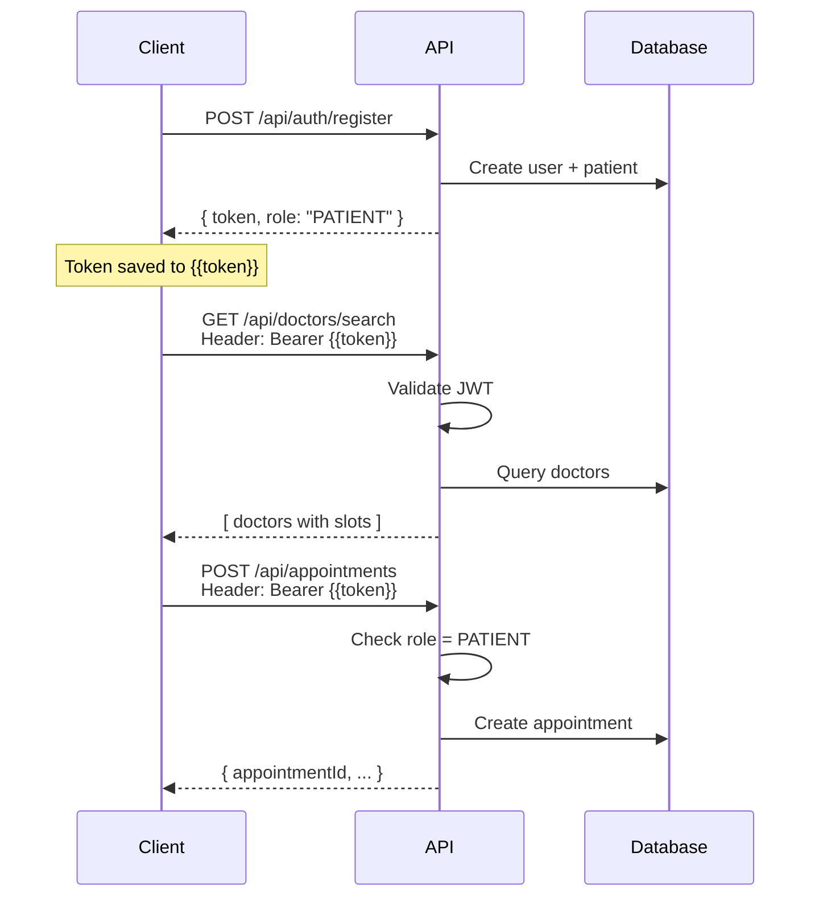

# 🧪 API Testing Files

Tài liệu và collection để test API của Online Doctor Appointment System.

---

## 📦 Files Included

### **1. Postman Collection**
📄 `Online-Doctor-Appointment-API.postman_collection.json`

**Chứa:**
- ✅ 20+ API requests đầy đủ
- ✅ Auto-save JWT tokens
- ✅ Built-in test assertions
- ✅ Request examples và documentation
- ✅ Security test cases

**Folders:**
- 🔐 Authentication (3 requests)
- 🏥 Specialties (1 request)
- 👨‍⚕️ Doctors (3 requests)
- 📅 Availability Blocks (4 requests)
- 📋 Appointments (2 requests)
- 🧪 Security Tests (3 requests)

---

### **2. Postman Environment**
📄 `Local-Development.postman_environment.json`

**Pre-configured variables:**
```
base_url = http://localhost:8000
token = (auto-filled)
patient_token = (auto-filled)
doctor_token = (auto-filled)
patient_id = 1
doctor_id = 1
```

---

### **3. User Guide**
📄 `POSTMAN_GUIDE.md`

**Nội dung:**
- 🚀 Quick start guide
- 🔐 Authentication flow
- 📂 Collection structure
- 🎯 Testing scenarios
- 🐛 Troubleshooting
- 🚀 Advanced tips

---

### **4. JWT Authentication Tests**
📄 `JWT_AUTH_TESTS.md`

**Nội dung:**
- Security rules summary
- Test cases với expected responses
- Postman test scripts
- Known issues

---

### **5. API Documentation**
📄 `API Documents.md`

**Nội dung:**
- Detailed API specifications
- Request/response examples
- Business logic descriptions
- Database schema references

---

## 🚀 Quick Start (3 Steps)

### **Step 1: Import vào Postman**

```bash
1. Mở Postman
2. Click "Import"
3. Chọn 2 files:
   - Online-Doctor-Appointment-API.postman_collection.json
   - Local-Development.postman_environment.json
4. Click "Import"
```

### **Step 2: Select Environment**

```bash
1. Click dropdown góc trên phải
2. Chọn "Local Development"
```

### **Step 3: Start Testing**

```bash
1. Start backend: ./mvnw spring-boot:run
2. Mở folder "🔐 Authentication"
3. Click request "Register Patient"
4. Click "Send"
5. ✅ Token tự động lưu!
6. Test các endpoints khác
```

---

## 📋 API Endpoints Summary

### **Public Endpoints (No Auth)**
```
GET  /api/specialties              → Get all specialties
POST /api/auth/register            → Register new patient
POST /api/auth/login               → Login
```

### **Authenticated Endpoints**
```
GET  /api/doctors                  → Get all doctors
GET  /api/doctors/search           → Search doctors with availability
GET  /api/doctors/{id}/detail      → Get doctor details
GET  /api/appointments             → Get appointments (future)
```

### **Patient Only**
```
POST /api/appointments             → Create appointment
```

### **Doctor Only**
```
POST   /api/doctors/{id}/availability     → Create availability block
GET    /api/doctors/{id}/availability     → Get availability blocks
DELETE /api/doctors/{id}/availability/{id} → Delete block
```

---

## 🔐 Authentication Flow



---

## 🧪 Test Scenarios

### **✅ Happy Path**
1. Register patient → Get token
2. Get specialties → Select specialty
3. Search doctors → Get available time slots
4. Create appointment → Success

### **❌ Error Cases**
1. Login with wrong password → 401 Unauthorized
2. Access protected endpoint without token → 403 Forbidden
3. Patient tries to create availability block → 403 Access Denied
4. Book already-booked time slot → 400 Bad Request

---

## 📊 Collection Statistics

| Category | Requests | Auth Required | Role Required |
|----------|----------|---------------|---------------|
| Authentication | 3 | ❌ No | - |
| Specialties | 1 | ❌ No | - |
| Doctors | 3 | ✅ Yes | Any |
| Availability | 4 | ✅ Yes | DOCTOR |
| Appointments | 2 | ✅ Yes | PATIENT |
| Security Tests | 3 | Mixed | - |
| **TOTAL** | **16** | **10** | **6** |

---

## 🎯 Variables Reference

### **Collection Variables** (Built-in)
```javascript
{{base_url}}       // http://localhost:8000
{{token}}          // Current user JWT token
{{patient_token}}  // Patient role token
{{doctor_token}}   // Doctor role token
```

### **Environment Variables** (Optional)
```javascript
{{patient_id}}     // 1
{{doctor_id}}      // 1
```

### **Dynamic Variables** (Postman Built-in)
```javascript
{{$timestamp}}     // Current timestamp
{{$randomInt}}     // Random integer
{{$guid}}          // Random GUID
```

**Usage Example:**
```json
{
  "email": "patient_{{$timestamp}}@test.com",
  "password": "pass{{$randomInt}}"
}
```

---

## 🔧 Environment Setup

### **Option 1: Use Collection Variables** (Recommended)
✅ No setup needed!  
✅ Variables built into collection  
✅ Works out of the box  

### **Option 2: Import Environment File**
1. Import `Local-Development.postman_environment.json`
2. Select "Local Development" environment
3. All variables pre-configured

### **Option 3: Manual Setup**
1. Create new environment
2. Add variables:
   - `base_url`: `http://localhost:8000`
   - `token`: (empty)
   - `patient_token`: (empty)
   - `doctor_token`: (empty)

---

## 📈 Test Assertions

Mỗi request có **built-in tests**:

```javascript
// Example: Login request
pm.test("Status code is 200", function () {
    pm.response.to.have.status(200);
});

pm.test("Response has token", function () {
    var jsonData = pm.response.json();
    pm.expect(jsonData.token).to.exist;
});

pm.test("Token is saved", function () {
    pm.environment.set("token", pm.response.json().token);
});
```

**View Results:**
- Click "Send"
- Check "Test Results" tab
- Green = Pass ✅
- Red = Fail ❌

---

## 🌍 Multi-Environment Support

Dễ dàng switch giữa environments:

### **Local**
```
base_url: http://localhost:8000
```

### **Staging**
```
base_url: https://staging-api.yourdomain.com
```

### **Production**
```
base_url: https://api.yourdomain.com
```

**Switch:**
1. Click dropdown góc trên phải
2. Chọn environment
3. Tất cả requests tự động dùng `base_url` mới

---

## 📝 Sample Data

### **Test Patient**
```json
{
  "email": "patient@test.com",
  "password": "password123",
  "fullName": "Nguyen Van A",
  "dateOfBirth": "1990-01-15",
  "gender": "MALE",
  "phoneNumber": "0912345678"
}
```

### **Test Doctor** (Cần tạo manual trong database)
```sql
INSERT INTO users (email, password_hash, role)
VALUES ('doctor@test.com', '$2a$10$...bcrypt...', 'DOCTOR');

INSERT INTO doctors (user_id, full_name, experience, bio)
VALUES (2, 'Dr. John Smith', 15, 'Experienced cardiologist');
```

---

## 🐛 Common Issues & Solutions

### **❌ 403 Forbidden**
**Problem:** Token expired or missing  
**Solution:** Re-run Login request

### **❌ Connection Refused**
**Problem:** Backend not running  
**Solution:** `./mvnw spring-boot:run`

### **❌ 400 Bad Request**
**Problem:** Invalid request body  
**Solution:** Check JSON format and required fields

### **❌ Token not saved**
**Problem:** Test script failed  
**Solution:** Check "Test Results" tab for errors

---

## 📚 Related Documentation

| File | Purpose |
|------|---------|
| `API Documents.md` | Complete API specifications |
| `JWT_AUTH_TESTS.md` | Security testing guide |
| `POSTMAN_GUIDE.md` | Detailed Postman usage |
| `README.md` | Project overview |

---

## ✅ Testing Checklist

- [ ] Import collection và environment
- [ ] Select "Local Development" environment
- [ ] Start backend server
- [ ] Test Register → Token saved ✅
- [ ] Test Login → Token saved ✅
- [ ] Test Get Specialties (public) ✅
- [ ] Test Search Doctors (authenticated) ✅
- [ ] Test Create Appointment (patient) ✅
- [ ] Test Security (403 errors) ✅
- [ ] Run entire collection ✅
- [ ] All tests pass ✅

---

## 🎉 Ready to Test!

```bash
# 1. Import files vào Postman
# 2. Start backend
./mvnw spring-boot:run

# 3. Click "Send" trên request đầu tiên
# 4. Watch magic happen! ✨
```

Happy Testing! 🚀🧪
